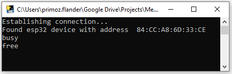

# Zoom/Teams Meeting Busy Light

Solution for easily detecting Zoom and Teams meetings and controlling the color of the remote busy light.

**Table of Contents**

- [Zoom/Teams Meeting Busy Light](#zoom/teams-meeting-busy-light)
  * [About The Project](#about-the-project)
    + [Built With](#built-with)
  * [Getting Started](#getting-started)
    + [Prerequisites](#prerequisites)
    + [App installation](#app-installation)
  * [Contact](#contact)

## About The Project

The project was developed to prevent the disruptions in home office with the help of the busy light. The busy light is controlled with a python script which runs on the user PC. The script detects when the Zoom or Teams window is opened and sends the status to ESP32 board via Bluetooth. ESP32's pin 2 is programmed to control external devices.

### Built With

* [PlatformIO](https://platformio.org)
* [Visual Studio Code](https://code.visualstudio.com)

## Getting Started

Follow this steps to set up the app.

### Prerequisites

* Visual Studio Code with PlatformIO plugin

### App installation

1. Upload the `main.cpp` code to the ESP32 board
2. Run `Busy light manager.exe` and wait until connection with the board is established

## Contact

Primoz Flander: [primoz.flander@gmail.com](<mailto:primoz.flander@gmail.com>)

Project Link: [Meeting busy light](https://github.com/primozflander/meeting_busy_light)
